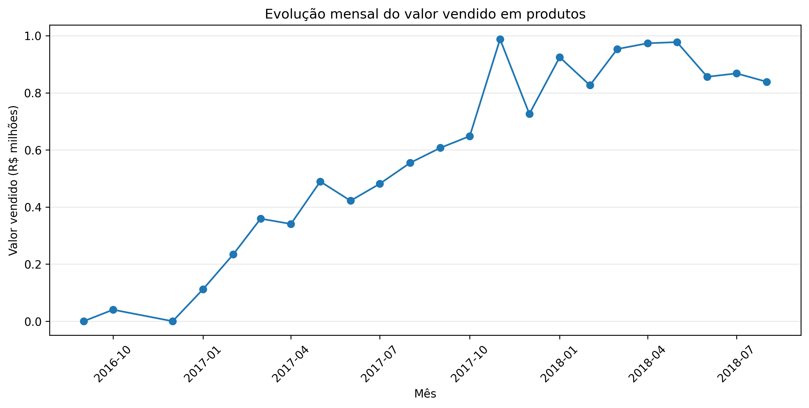
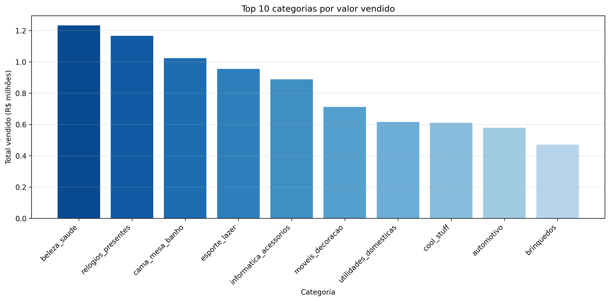
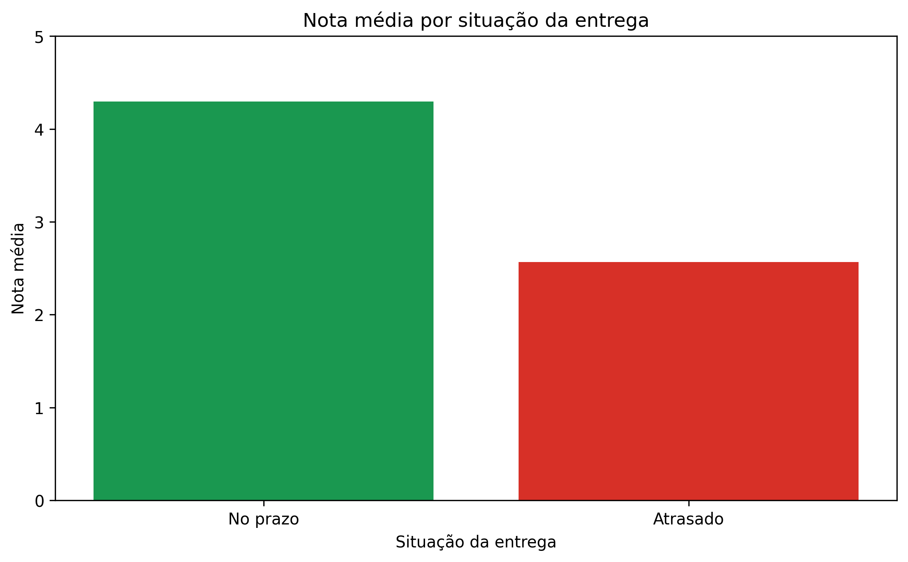

# Análise de Dados - E-commerce Olist

## Sobre o projeto

Projeto de análise de dados desenvolvido a partir do dataset público da Olist, com o objetivo de explorar dados de um e-commerce, identificar padrões e gerar insights relacionados a vendas, produtos, pagamentos, avaliações e entregas.

O projeto está sendo desenvolvido de forma incremental, passando pelas etapas de exploração, tratamento, análise, consultas em SQL e visualização dos dados.

## Objetivos

- Explorar e compreender os datasets utilizados.
- Avaliar a qualidade dos dados.
- Realizar o tratamento e preparação dos dados.
- Analisar indicadores relacionados ao e-commerce.
- Utilizar Python e Pandas para análise e tratamento.
- Utilizar SQL para consultas e análises.
- Desenvolver visualizações com Matplotlib.
- Criar um dashboard no Power BI.
- Gerar insights relevantes para o negócio.

## Tecnologias utilizadas

- Python
- Pandas
- Matplotlib
- SQL
- Power BI
- Jupyter Notebook
- Git e GitHub

## Estrutura do projeto

```text
analise-ecommerce-olist/
│
├── data/
│   ├── raw/
│   └── processed/
│
├── images/
│   ├── avaliacoes_clientes.png
│   ├── evolucao_vendas_mensais.png
│   ├── nota_media_entrega.png
│   ├── pagamentos_mais_utilizados.png
│   ├── top10_categorias_qtd_itens.png
│   └── top10_categorias_valor_vendido.png
│
├── notebooks/
│   ├── 01_exploracao_inicial.ipynb
│   ├── 02_tratamento_dados.ipynb
│   └── 03_analise_exploratoria.ipynb
│
├── powerbi/
│
├── sql/
│   └── consultas.sql
│
└── README.md
```

## Dados

Os dados utilizados no projeto estão organizados em duas etapas:

- `data/raw/`: datasets originais da Olist, sem alterações;
- `data/processed/`: datasets gerados após o processo de tratamento e preparação dos dados.

## Status do projeto

- [x] Exploração inicial dos dados
- [x] Tratamento e preparação dos dados
- [x] Análise exploratória e visualizações
- [x] Consultas e modelagem em SQL
- [ ] Dashboard em Power BI
- [ ] Conclusões e insights finais

### Tratamento realizado

Durante a etapa de tratamento e preparação dos dados foram realizadas:

- conversão das colunas de data para `datetime`;
- análise e tratamento dos valores ausentes;
- investigação de inconsistências nos dados;
- correção de registros com quantidade de parcelas igual a zero;
- análise de inconsistências entre as datas dos pedidos;
- padronização da nomenclatura de colunas;
- validação dos dados após o tratamento;
- geração dos datasets tratados em `data/processed`.

### Análise exploratória

A análise exploratória foi orientada por perguntas de negócio relacionadas ao desempenho do e-commerce. Foram analisados:

- valor total vendido em produtos;
- quantidade de pedidos entregues e ticket médio;
- evolução mensal das vendas;
- categorias com maior valor vendido;
- categorias com maior quantidade de itens vendidos;
- formas de pagamento mais utilizadas;
- distribuição das avaliações dos clientes;
- relação entre atraso na entrega e avaliação dos clientes.

#### Principais resultados

- aproximadamente **R$ 13,22 milhões** em produtos vendidos, considerando pedidos entregues;
- **96.478 pedidos entregues**, com ticket médio de aproximadamente **R$ 137,04**;
- destaque para as categorias **beleza_saude**, **relogios_presentes** e **cama_mesa_banho** em valor vendido;
- predominância do **cartão de crédito** como forma de pagamento;
- pedidos entregues no prazo apresentaram avaliação média de aproximadamente **4,29**, enquanto pedidos atrasados apresentaram média de **2,57**.

#### Evolução das vendas mensais



#### Categorias com maior valor vendido



#### Relação entre prazo de entrega e avaliação



### Análises SQL

Após a análise exploratória em Python, os dados tratados foram importados para o SQL Server para realização de consultas analíticas.

Foram desenvolvidas as seguintes análises:

1. Valor vendido por estado;
2. Ticket médio por estado;
3. Categorias com maior valor vendido por estado;
4. Prazo médio de entrega por estado;
5. Identificação de clientes recorrentes.

As consultas completas estão disponíveis em [`sql/consultas.sql`](sql/consultas.sql).

## Como executar

```bash
git clone https://github.com/gsrizzo/analise-ecommerce-olist.git

cd analise-ecommerce-olist

jupyter notebook
```

## Autor

Gabriel Rizzo — [LinkedIn](https://www.linkedin.com/in/gabrielrizzo97) — [GitHub](https://github.com/gsrizzo)